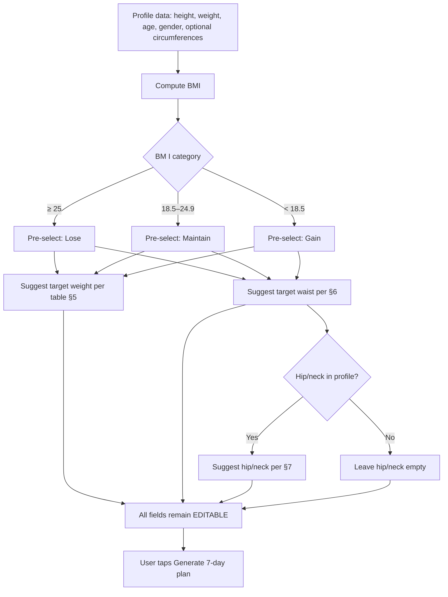

# C BY AI — Target screen logic (client approval)

**Document purpose:** Describe how the app **pre-fills** the **Targets** step (step 2 of C BY AI) from the user’s **Profile** data, using **general WHO-style reference** values for adults.  
**Product rule:** Every pre-filled value is **fully editable** in the app before the user generates the 7-day plan.

**Version:** Matches app implementation in `who_health_targets.dart` + `c_by_ai_target_setup_screen.dart`.

---

## 1. Inputs (from Profile step / Firestore)

| Field | Key in app | Used for |
|--------|------------|----------|
| Height (cm) | `height` | BMI, healthy weight band, all weight logic |
| Weight (kg) | `weight` | BMI, target weight |
| Age (years) | `age` | Copy / disclaimer (under 18 warning only) |
| Gender | `gender` | Male vs female for **waist** cut-offs (`m`… → male, else female) |
| Waist (cm) | `waist_circumference` | Target waist (if missing, see §4) |
| Hip (cm) | `hip_circumference` | Target hip **only if** provided (> 0) |
| Neck (cm) | `neck_circumference` | Target neck **only if** provided (> 0) |

---

## 2. BMI (adults — WHO classification)

**Formula:** `BMI = weight_kg / (height_m)²` where `height_m = height_cm / 100` (clamped 0.5–2.5 m).

| BMI range | WHO category (in-app label) |
|-----------|-----------------------------|
| **&lt; 18.5** | Underweight |
| **18.5 – 24.9** | Normal weight |
| **25.0 – 29.9** | Overweight |
| **≥ 30.0** | Obesity |

---

## 3. “Healthy weight” band (same height, BMI 18.5–24.9)

Used for messaging and for some target-weight suggestions.

| | Formula |
|---|--------|
| **Min weight (kg)** | `18.5 × height_m²` |
| **Max weight (kg)** | `25.0 × height_m²` *(upper edge of normal band used as top of range in copy)* |

*Note: WHO “normal” is up to 24.9; the app uses **25.0** as the upper bound of the displayed healthy band for simplicity.*

---

## 4. Auto-selected **Fitness goal** (user can change)

| Condition (BMI) | Pre-selected goal |
|-----------------|-------------------|
| BMI **≥ 25** | **Lose weight** |
| BMI **&lt; 18.5** | **Gain muscle** |
| Otherwise | **Maintain weight** |

---

## 5. Auto-suggested **target weight (kg)**

Rounded to **1 decimal**. Depends on **goal** (after auto-selection above).

| Goal | Condition | Suggested target weight (kg) |
|------|-----------|------------------------------|
| **lose** | BMI **≥ 30** | `max(wMin + 0.5, min(current × 0.90, current − 2))` |
| **lose** | **25 ≤ BMI &lt; 30** | `max(wMin + 0.5, min(mid, current − 1))` where `mid = (wMin + wMax) / 2` |
| **lose** | BMI **&lt; 25** *(edge case)* | `current × 0.98` |
| **gain** | — | `min(wMax − 0.5, max(mid, current + 1))` where `mid = (wMin + wMax) / 2` |
| **maintain** | — | `current` (rounded) |

`wMin` / `wMax` = healthy band from §3.

---

## 6. Waist reference (Europid-style cut-offs) & **target waist (cm)**

**Reference thresholds (in-app constants):**

| Sex | “Increased risk” (cm) | “High” (cm) |
|-----|------------------------|-------------|
| **Male** | 94 | 102 |
| **Female** | 80 | 88 |

**If user did not enter waist on profile:** the app uses a **placeholder current waist** for calculation only: **male 88 cm**, **female 74 cm** (94−6 / 80−6). The client may wish to require waist on profile instead.

**Target waist** (rounded 1 decimal), by **goal**:

| Goal | Rule |
|------|------|
| **lose** | If current **≥ high** → `current − 8` (clamped). Else if current **≥ increased** → `increased − 4` (clamped below current). Else → `current × 0.97`. |
| **gain** | `current × 1.01` |
| **maintain** | `current × 0.995` |

---

## 7. Target **hip** and **neck** (cm)

Only pre-filled if profile already has a value **&gt; 0**.

| Goal | Target hip | Target neck |
|------|------------|-------------|
| **lose** | current × **0.98** | current × **0.99** |
| **gain** | current × **1.01** | current × **1.01** |
| **maintain** | **unchanged** | **unchanged** |

---

## 8. Dietary preference

**Default:** `balanced` (user can change to high protein / vegan / light & fresh).

---

## 9. Flowchart (decision overview)

---

## 10. Legal / UX disclaimer (shown in app)

- Text is **educational**, based on **general** WHO-style guidance for **adults**.  
- **Not** a medical diagnosis or treatment plan.  
- Waist cut-offs follow **commonly cited Europid** values; **other ethnic groups** may use different thresholds (WHO acknowledges population differences).  
- Users **under 18**: app shows that guidance is **adult-oriented** and a **clinician** should set goals for minors.

---

## 11. Client sign-off

| Item | Approve (Y/N) | Notes |
|------|---------------|-------|
| BMI thresholds (18.5 / 25 / 30) | | |
| Healthy weight band display (18.5–25 BMI) | | |
| Auto goal vs BMI | | |
| Target weight formulas | | |
| Waist thresholds (94/102 male, 80/88 female) | | |
| Placeholder waist if missing (88/74) | | |
| Hip/neck scaling when present | | |
| Default diet = balanced | | |
| All values editable | | |

**Approved by:** _________________ **Date:** _________________

---

*This file can be exported to PDF from Markdown for the client.*
